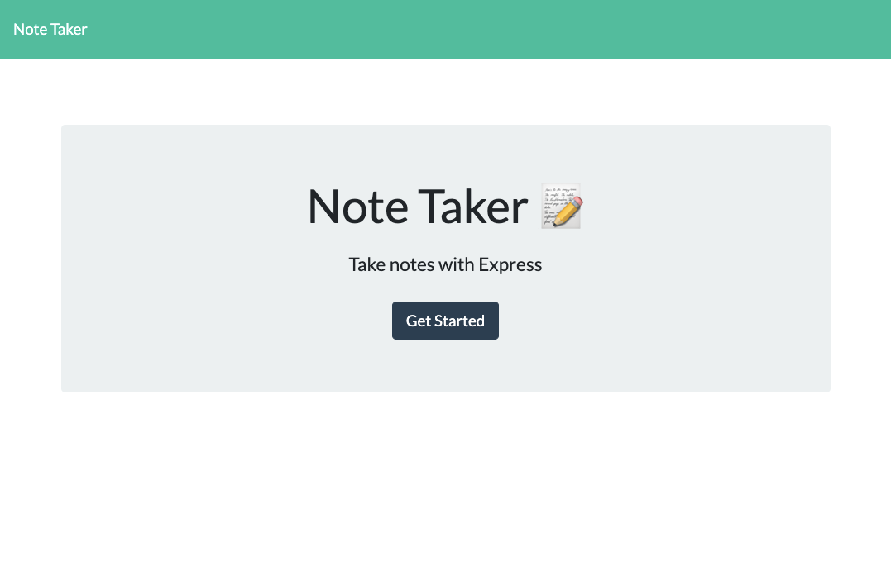

# Note Taker

# Badges


Table of Contents
- [License](#license)
- [Installation](#installation)
- [Usage](#usage)
- [Credits](#credits)


# Installation

Run this command in the terminal to install inquirer.
```
npm i inquirer@8.2.4
```


# Usage
When you run the application in the browser, you'll be taken to the starter page: 


Click on the 'Get Started' button to get to the notes page:


Click on each note view the details:


# Deployed Application


# Contact
Github: Amandagl1
Email: leeandama87@gmail.com